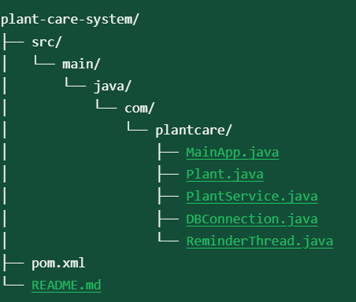
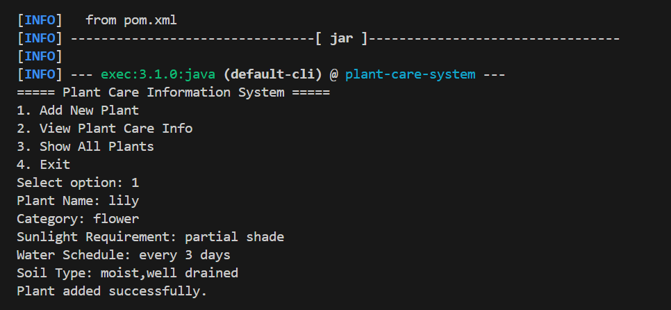

# 🌿 Plant Care Information System

A simple Java-based system to manage and track plant care details such as sunlight, watering, and soil preferences — with regular health reminders 🪴✨

---

# 🚀 Features

- 🌱 Add new plant with full details  
- 🔍 View care information for any plant  
- 📋 List all saved plants  
- ⏰ Background reminder every minute  
- ✅ PostgreSQL database integration using JDBC  
- ☕ Built with Java + Maven  

---

# 🛠️ Technologies Used

- ✅ Java (Core)  
- ✅ JDBC  
- ✅ PostgreSQL  
- ✅ Maven  

---

#🧪 How to Run

# 1️⃣ Install PostgreSQL

- Create a database named: plant_care_db  
- Create the following table:
: sql

CREATE TABLE plants (
    id SERIAL PRIMARY KEY,
    name VARCHAR(50),
    category VARCHAR(50),
    sunlight VARCHAR(50),
    water_schedule VARCHAR(50),
    soil_type VARCHAR(50)
);

---

# 2️⃣ Setup Project and Folder Structure

- Open the project folder in *VS Code*  
- Ensure pom.xml contains the PostgreSQL JDBC dependency  
- Folder structure should look like:

  

---

# 3️⃣ Configure Database Connection

In DBConnection.java, update your credentials:
java
String url = "jdbc:postgresql://localhost:5432/plantdb";
String user = "postgres";
String password = "postgres_pass";

---

# 4️⃣ Compile & Run the App

Open terminal inside the project folder and run:
bash
mvn clean compile
mvn exec:java

---

# 📸 Sample Output

  

⏰ Every 1 minute:

Reminder: Check your plants and update their health if needed.

---

# 👨‍💻 Author 

Snigdha Kandikatla

---

